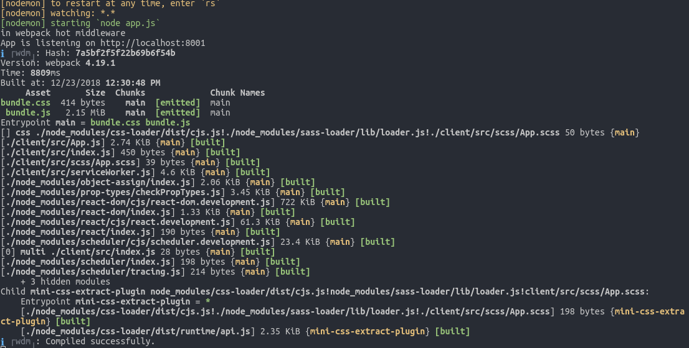

# ISDB

ISDB is a startup information web app, that aims at providing mechanism for user to get the information about all the startups, and also find out startup information according to their need. On this platform user can make their favourite startup list, and all other interaction that helps them to get the better information on startups.
You can find the project's wireframe below which depicts the basic flow of our web application.

## Project Wireframe

## Get Started
ISBD consists of two part like all web application.  
* Frontend - React, Redux, SCSS
* Backend - Node, MongoDB, Express

## Color Pallet

## Class Convention

## Font-Families

## Learn About Folder Structure 
``` 
Note : The folder structure may changes i.e we may include/exclude some folders/files as project progresses but the overall sructure will remain as presented below:
```

### Backend Part
All server related files are in './server'.
* '/controllers' --  Methods to interact with DB and reflects the data on views.
* '/models' -- MongoDB collections schema
* '/modules' -- Contains all the modules that is going to necessay for applications behaviour like passport.js
* 'views' -- Apllication related htmls files related to application routes
* '/db' -- MongoDB Driver code to be used in application
* './app.js' -- Contains the application main server related code

### Frontend Part


### Common To Both Frontend and Backend
* package.json -- Contain all the packages for the application
* eslintrc.json -- Contain all the configuration of styling javascript. Using Airbnb style-guide for linting

## Packages Used
All packages can find in `./package.json`.
```
Note : Packages are not confirmed yet. They might can be changed.
```
### Frontend Packages

### Backend Packages
* `nodemon` -- Used for live server reloading.
* `express` -- express framework for backend.
* `pug` -- View engine for backend.

### Necessay Packages for bundling and transpiling
* @babel/plugin-proposal-class-properties
* @babel/preset-react
* css-loader
* file-loader
* mini-css-extract-plugin
* sass-loader
* style-loader
* svg-inline-loader
* webpack-cli
* webpack-dev-server
* webpack-hot-middleware

### Common Packages to both Frontend and Backend
* eslint
* eslint-config-airbnb-base
* eslint-plugin-import

## Bundle and Transpiler
* webpack -- Configuration file path is `./webpack.config.js`. Used for bundling frontend for serving it into backend.
* babel -- Configuration file path is `./babelrc`. Used for transpiling all the ES6 and above syntax into ES5.

## How to launch the app locally?
* 1 -- Fork the project repo and clone it in your local directory.
* 2 -- Download and install Node(latest stable version) (npm comes along with node).<br/>
-- [Node](https://nodejs.org/)<br/>
-- [NPM](https://www.npmjs.com/)
```
verify with below command
>>>node -v
>>>npm -v
```

* Make sure you run all your commands inside cloned /ISDB folder
* 3 -- Install the npm modules from the package.json
```
>>> npm install
this command installs all the node related packages required to run the app locally in 
/node_modules folder. You can see this folder inside /ISDB folder after running npm install
```
* 4 -- Launch the application using below command:
```
Below command will run gulpfile.js and start the static website(Frontend)
>>> npm install -g nodemon
>>> npm start
The application will be running at http://localhost:8001 URL
```


* 5 -- No more steps
```
Now you don't need to repeat above steps always to run the app rather its one time task.
But if you clone the project in new location then again you need to repeat step 3(only).
```


